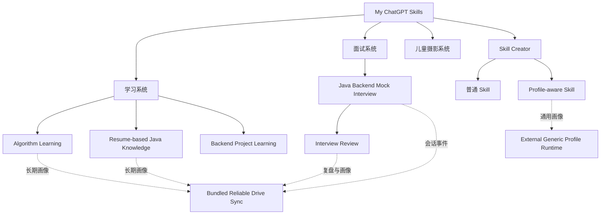
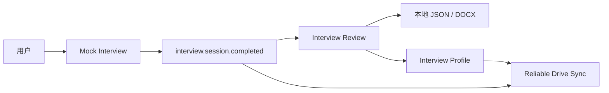
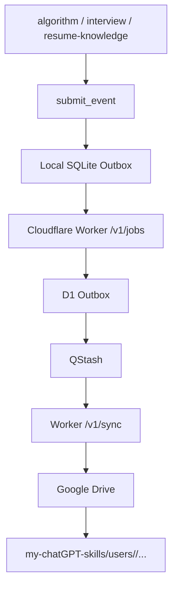
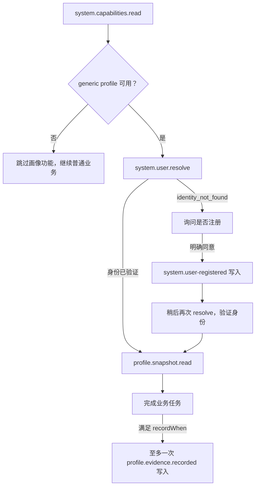

<!-- File: README.md -->

# My ChatGPT Skills

一个面向个人长期使用场景构建的 **ChatGPT / Codex / WorkBuddy Skill 集合**。

本仓库不仅保存若干独立 Skill，还提供了一套统一的：

- 用户身份体系
- 跨会话学习画像
- 事件化持久化协议
- Reliable Drive Sync 异步同步基础设施
- Skill 创建与验证规范

目标不是把所有能力塞进一个巨大 Agent，而是让不同 Skill 各自负责一个清晰领域，同时在需要时共享同一个用户身份和长期数据。

---

## 1. 项目能力总览

目前仓库包含 7 个主要 Skill。

| Skill | 主要用途 | 长期画像 |
|---|---|---|
| [algorithm-learning](./algorithm-learning/) | LeetCode、算法题、代码诊断、渐进提示、每日练习 | ✅ |
| [java-knowledge-based-on-resume-learn-skill](./java-knowledge-based-on-resume-learn-skill/) | 根据个人简历学习 Java 后端八股 | ✅ |
| [backend-project-learning](./backend-project-learning/) | 从真实源码学习后端项目与业务链路 | ❌ |
| [conducting-java-backend-mock-interviews](./conducting-java-backend-mock-interviews/) | Java 后端模拟面试 | ✅ |
| [reviewing-java-backend-interviews](./reviewing-java-backend-interviews/) | 模拟/真实面试复盘与画像更新 | ✅ |
| [child-photoShop-skill](./child-photoShop-skill/) | 儿童摄影选片、调色、精修与风格迁移 | ❌ |
| [profile-aware-skill-creator](./profile-aware-skill-creator/) | 创建普通 Skill 或带长期用户画像的 Skill | 按生成目标决定 |

---

# 2. Skill 体系



每个 Skill 都有自己的明确责任边界。

例如：

- 算法 Skill 不承担完整 Java 后端模拟面试。
- Java 八股 Skill 不承担整场面试。
- 模拟面试 Skill 不负责最终复盘评分。
- 面试复盘 Skill 不修改原始回答。
- 后端项目学习 Skill 不允许把教学假设说成真实项目事实。
- 儿童摄影 Skill 不允许为了“美化”改变儿童身份特征。
- Profile-Aware Skill Creator 不替业务 Skill 决定用户画像应该记录什么。

这种拆分让每个 Skill 都可以单独测试、演进和替换。

---

# 3. 学习系统

## 3.1 Algorithm Learning

目录：

```text
algorithm-learning/
```

适用于：

- LeetCode
- Hot 100
- 动态规划
- 回溯
- 图与树
- 滑动窗口
- 二分
- 单调栈
- 代码 Debug
- 时间复杂度分析
- 算法复习计划

当用户提供自己的代码时，Skill 会优先：

1. 理解用户当前思路。
2. 判断核心路线是否正确。
3. 找出编译、运行时、逻辑、边界或复杂度问题。
4. 给出最小修改。
5. 必要时再给推荐实现。

不会因为用户代码写得不够“标准”，就直接重写成完全不同的解法。

如果用户只想要提示，则按照：

```text
题型方向
  ↓
核心观察
  ↓
状态 / 数据结构含义
  ↓
伪代码
  ↓
局部代码
  ↓
完整实现
```

逐层揭示答案。

算法学习完成后，会形成一条有证据的学习事件并生成长期算法画像，用于后续薄弱点分析和每日练习。

详细说明：

[algorithm-learning/README.md](./algorithm-learning/README.md)

---

## 3.2 Resume-based Java Knowledge

目录：

```text
java-knowledge-based-on-resume-learn-skill/
```

这是一个**严格依据用户个人简历出题**的 Java 后端知识学习 Skill。

主要覆盖：

- Java
- JVM
- MySQL
- Redis
- MQ
- Spring
- 微服务
- 简历中实际出现的中间件
- 项目相关技术追问

核心关系：

```text
简历声明
   ↓
知识点
   ↓
规范题目
   ↓
推荐回答链
   ↓
评分要点
   ↓
个人掌握度
```

Skill 不会因为“Java 面试经常考某知识”就自动认为用户简历中存在该技术。

证据不足时宁可不出题，也不会虚构简历事实。

详细说明：

[java-knowledge-based-on-resume-learn-skill/README.md](./java-knowledge-based-on-resume-learn-skill/README.md)

---

## 3.3 Backend Project Learning

目录：

```text
backend-project-learning/
```

用于学习陌生后端项目。

它不是普通“代码解释器”，而是试图把：

```text
业务流程
   ↓
真实源码
   ↓
数据变化
   ↓
异常分支
   ↓
技术设计
   ↓
面试问题
   ↓
STAR 表达
```

串成完整学习闭环。

默认输出：

```text
Mermaid
→ 源码索引
→ 分层讲解
→ 成功案例
→ 失败/补偿分支
→ 面试题
→ 标准答案
→ STAR 复述
```

所有项目结论必须区分：

- 源码事实
- 教学假设
- 优化建议

详细说明：

[backend-project-learning/README.md](./backend-project-learning/README.md)

---

# 4. Java 后端面试系统

Java 面试系统目前由两个 Skill 配合完成。



---

## 4.1 Mock Interview

目录：

```text
conducting-java-backend-mock-interviews/
```

主要负责：

- 按姓名解析用户
- 根据简历、项目、历史弱点生成问题
- 一次一道主问题
- 连续追问
- 保存原始回答
- 保存完整时间线
- 生成不可变面试会话事件

它**不负责最终评分和整场复盘**。

这样可以确保：

> 面试原始证据与事后分析彼此分离。

详细说明：

[conducting-java-backend-mock-interviews/README.md](./conducting-java-backend-mock-interviews/README.md)

---

## 4.2 Interview Review

目录：

```text
reviewing-java-backend-interviews/
```

用于：

- 模拟面试复盘
- 真实面试复盘
- 逐题评分
- 错误分析
- 遗漏分析
- 更好的口述答案
- 变式复测
- 面试画像更新
- 生成 Word 报告

本地报告：

```text
outputs/interview/<userId>/
├── interview-<sessionId>-session.json
├── interview-<sessionId>-report.json
└── interview-<sessionId>-report.docx
```

其中 Word 报告属于本地派生输出，不作为画像输入。

详细说明：

[reviewing-java-backend-interviews/README.md](./reviewing-java-backend-interviews/README.md)

---

# 5. Child Photoshop Skill

目录：

```text
child-photoShop-skill/
```

这是针对儿童摄影馆工作流设计的后期 Skill。

核心原则：

> **Do not redesign the child. Retouch the photograph.**

也就是：

> 不重新设计孩子，只精修照片。

支持：

- 从模板图学习风格
- Style Profile
- 批量统一调色
- 技术质量分析
- 连拍去重
- 选片
- Contact Sheet
- 背景处理规范
- 儿童身份保护
- 表情保护
- 童真保护
- 风格库原型

其中身份保持属于最高优先级约束之一。

详细说明：

[child-photoShop-skill/README.md](./child-photoShop-skill/README.md)

---

# 6. Profile-Aware Skill Creator

目录：

```text
profile-aware-skill-creator/
```

这是整个仓库的 Skill 生产工具。

创建新 Skill 时首先区分：

```text
这个 Skill 是否需要跨会话保存并读取用户画像？
```

如果不需要：

```text
Plain Skill
```

如果需要：

```text
Profile-aware Skill
```

Profile-aware Skill 会额外获得：

```text
references/profile-contract.md
schemas/profile-capability.json
tests/test_profile_contract.py
```

并接入统一的：

```text
system.capabilities.read
system.user.resolve
profile.snapshot.read
profile.evidence.recorded
```

等 Profile 协议。

详细说明：

[profile-aware-skill-creator/README.md](./profile-aware-skill-creator/README.md)

---

# 7. Reliable Drive Sync

多个需要长期状态的 Skill 共用 `submit_event` 协议、全局身份模型和异步回执语义，但当前实现分为两个运行时边界。

本仓库内置 Worker/MCP 的现有 Skill 写入链路：



这张图只描述**写入路径**。内置运行时的只读 `interview.session.list`、`interview.session.load` 和 legacy migration dry-run 走 `/v1/query`，不进入 SQLite 或 D1 Outbox。

核心原则：

> Skill 永远不直接写 Google Drive。

所有业务写入统一经过：

```text
Skill
→ submit_event
→ Local SQLite Outbox
→ Worker
→ D1 Outbox
→ QStash / Worker
→ Google Drive
```

这样即使：

- 网络临时中断
- 客户端退出
- Worker 暂时不可访问
- Drive 临时失败

本地事件仍可保留并继续重试。

## 7.1 当前持久化边界（Phase 1）

当前有两类彼此独立的业务契约和运行时实现：

- **仓库内置运行时**：`tools/reliable-drive-sync-mcp/` 与 `services/reliable-drive-sync-worker/` 服务 `algorithm`、`interview`、`resume-knowledge` 等既有 Skill-owned 契约，保留各自事件格式、目录和 reducer。
- **外部通用 Profile 运行时**：新生成的 Profile-aware Skill 使用 `profile` namespace。它先通过 `system.capabilities.read` 确认部署端支持 generic profile，再使用 `system.user.resolve`、`profile.snapshot.read` 和 `profile.evidence.recorded`。本仓库内置 Worker 的事件列表不包含这些通用读写操作，不能替代外部运行时。

两类运行时共享协议基线、全局身份原则和写入回执语义，但只对**写操作**使用两级 Outbox；能力查询、身份解析和 Snapshot 读取都是只读操作，不进入 Outbox。两类数据不会自动互相转换。旧 namespace 数据只读；迁移只能先 dry-run，再由用户明确批准执行。

通用 Profile 的运行顺序为：



注册只在 `identity_not_found` 后且用户明确同意时发生。`pending` 或 `cloud_accepted` 的注册回执都不能替代后续成功的 `system.user.resolve`；能力不支持或身份未验证时，只关闭画像功能，普通业务仍继续。

---

# 8. submit_event

两个运行时都把上层接口收敛为一个工具：

```text
submit_event
```

但它们支持的 namespace 与 eventType 不同，调用前必须遵循各自的能力与事件契约。下面是仓库内置运行时的写 envelope 示例：

```json
{
  "schemaVersion": "1.2",
  "namespace": "algorithm",
  "eventType": "algorithm.learning.completed",
  "identity": {
    "username": "Example User"
  },
  "payload": {},
  "requestId": "<uuid>"
}
```

不同 Skill 只需要负责：

1. 构造正确事件。
2. 提交给 `submit_event`。
3. 正确理解回执。

而不用自己关心：

- Drive API
- D1
- QStash
- 重试
- Outbox
- 幂等投递
- 文件创建

---

# 9. 回执语义

以下语义只适用于进入 Outbox 的写操作。只读操作直接返回查询状态，不产生 `pending` 或 `cloud_accepted` 写回执。

## cloud_accepted

```text
deliveryState: "cloud_accepted"
```

表示：

```text
SQLite 已持久化
+
D1 Outbox 已接受任务
```

但：

```text
Google Drive 仍可能处于 pending
```

因此不能把它解释为：

> “Drive 已经保存成功。”

---

## pending

```text
deliveryState: "pending"
```

表示：

```text
事件已经安全保存在本地 SQLite Outbox
```

但尚未确认进入 D1。

客户端可以退出，后续继续重试。

---

# 10. 全局用户身份

用户身份不是按 Skill 分开的，但两类运行时的解析流程不同。

整个系统使用统一：

```text
displayName
   ↓
NFKC normalize
   ↓
trim
   ↓
Global User Registry
   ↓
Stable userId
```

同一用户名在：

- algorithm
- interview
- resume-knowledge
- profile

等不同领域中都会解析到同一个稳定 `userId`。

业务 Skill 不自行生成 userId。既有 Skill 按各自 contract 调用 `system.user-registered` 完成解析或注册；通用 Profile Skill 必须先 `system.user.resolve`，只有收到 `identity_not_found` 并取得用户明确同意后才能注册，且需在之后再次 resolve 成功才能读取或写入画像。

---

# 11. Google Drive 数据结构

规范根目录：

```text
DriveRoot/
└── my-chatGPT-skills/
    ├── user-registry/
    │
    └── users/
        └── <userId>/
            ├── identity.json
            │
            ├── algorithm/
            │   ├── events/
            │   ├── profile/
            │   │   └── snapshots/
            │   └── plans/
            │       └── daily/
            │
            ├── interview/
            │   ├── events/
            │   └── profile/
            │       └── snapshots/
            │
            ├── resume-knowledge/
            │   ├── sources/
            │   ├── question-bank/
            │   ├── events/
            │   ├── profile/
            │   │   └── snapshots/
            │   └── plans/
            │       └── daily/
            │
            └── <profile-domain>/
                ├── events/
                └── profile/
                    └── snapshots/
```

`<profile-domain>` 代表由外部通用 Profile 运行时验证的非保留 kebab-case domain；路径由运行时从已验证身份和 domain 推导，Skill 不自行拼接文件路径。保留的 `algorithm`、`interview`、`resume-knowledge` 仍由内置专用实现管理。

事件原则上是追加式的。

画像 Snapshot 属于从已验证事件得到的派生状态，而不是随意覆盖的“记忆文件”。

---

# 12. 为什么采用 Event + Snapshot

整个长期画像系统倾向采用：

```text
Immutable Events
      ↓
Reducer
      ↓
Current Snapshot
```

而不是：

```text
直接修改 profile.json
```

这种设计带来几个好处。

### 可追溯

可以知道一个掌握度为什么发生变化。

### 可重建

Snapshot 损坏时，可以从历史事件重新计算。

### 可审计

不会因为一次错误写入静默覆盖全部历史。

### 易扩展

新的 Skill 可以记录自己的 evidence，而不用直接修改其他 Skill 的数据。

---

# 13. 仓库结构

```text
my-chatgpt-skills/
│
├── README.md
├── AGENTS.md
│
├── algorithm-learning/
├── backend-project-learning/
├── child-photoShop-skill/
├── conducting-java-backend-mock-interviews/
├── java-knowledge-based-on-resume-learn-skill/
├── profile-aware-skill-creator/
├── reviewing-java-backend-interviews/
│
├── services/
│   └── reliable-drive-sync-worker/
│
├── tools/
│   └── reliable-drive-sync-mcp/
│
├── tests/
└── docs/
```

---

# 14. README 与 SKILL.md 的区别

本仓库刻意区分两类文档。

## README.md

主要给人阅读。

负责解释：

- 这个 Skill 是什么
- 什么时候使用
- 能做什么
- 如何配合其他模块
- 整体架构是什么

---

## SKILL.md

主要给 Agent 执行。

负责定义：

- 精确行为
- 强制流程
- 数据契约
- 错误处理
- 工具调用
- 安全边界
- 必须遵守的规则

因此：

> README 不应该成为 SKILL.md 的完整复制品。

真正决定 Agent 行为的仍然是 `SKILL.md`。

---

# 15. services

云端运行服务：

```text
services/
└── reliable-drive-sync-worker/
```

Worker 负责：

- schema-1.2 envelope 校验
- 用户身份解析
- D1 Outbox
- 幂等
- Event routing
- Snapshot materialization
- QStash 异步投递
- Google Drive 写入
- Legacy migration 安全控制

入口：

[services/README.md](./services/README.md)

---

# 16. tools

本地工具：

```text
tools/
└── reliable-drive-sync-mcp/
```

本地 MCP 负责：

- stdio MCP
- `submit_event`
- SQLite Outbox
- 客户端配置
- 网络失败重试
- Worker ingress

入口：

[tools/README.md](./tools/README.md)

---

# 17. 创建新的 Skill

推荐使用：

```text
profile-aware-skill-creator
```

创建之前先回答：

> 这个 Skill 是否需要保存并读取跨会话个人画像？

---

## 普通 Skill

适用于：

- 文本处理
- 一次性分析
- 图片工作流
- 项目代码学习
- 不需要用户长期状态的工具

结构通常为：

```text
new-skill/
├── SKILL.md
├── agents/
├── references/
├── scripts/
└── tests/
```

---

## Profile-aware Skill

适用于：

- 长期学习
- 掌握度跟踪
- 个性化推荐
- 长期训练
- 历史表现分析

需要额外定义：

```text
Observable Evidence
        ↓
Profile Dimension
        ↓
Reducer
        ↓
Snapshot
```

不要直接保存模型的主观印象。

---

# 18. Profile 设计原则

Profile 应尽量只记录：

> 可以从用户真实行为中观察到的证据。

例如：

```text
用户提交了一道 DP 题
用户在状态转移上出现错误
用户完成一道题
用户明确表示某题不会
用户回答了一道 JVM 面试题
用户在某知识点得到 72 分
```

而不是直接保存：

```text
这个用户很聪明
这个用户不擅长算法
这个用户适合做后端
```

Profile 应来自证据，而不是模型印象。

---

# 19. 测试

不同 Skill 根据复杂度拥有自己的测试体系。

例如：

```text
algorithm-learning/tests/
child-photoShop-skill/tests/
services/reliable-drive-sync-worker/test/
tools/reliable-drive-sync-mcp/test/
```

测试通常覆盖：

- Skill contract
- Schema contract
- Event validation
- Profile behaviour
- Outbox behaviour
- Idempotency
- Prompt contract
- Script behaviour
- Persistence boundary

修改 Skill 行为时，应优先同步更新测试，而不是只修改 Markdown。

---

# 20. Legacy 数据

旧版本 namespace 目录属于只读兼容数据。

迁移不会自动执行。

统一采用：

```text
dry-run
   ↓
用户明确批准
   ↓
execute
```

原则：

- 不覆盖
- 不移动
- 不删除旧数据
- 冲突时停止
- 执行前重新校验计划

---

# 21. 设计原则

这个仓库目前遵循几个重要原则。

### 一个 Skill，一个主要职责

避免巨大万能 Agent。

### 一个用户，一个全局 userId

避免不同 Skill 产生互相隔离的身份。

### 一个远端写入口

```text
submit_event
```

避免每个 Skill 自己实现云存储。

### Event 是事实

Snapshot 是派生结果。

### 本地优先保证可靠性

先进入 SQLite，再尝试网络提交。

### Agent 不伪造持久化成功

`cloud_accepted` 不等于 Drive 已写完。

### 事实与推断分离

源码学习、简历学习、画像系统都遵守这一原则。

---

# 22. 当前项目定位

`my-chatgpt-skills` 已经不仅仅是一个提示词仓库。

它逐渐形成的是一套：

```text
Personal AI Skill Platform
```

其中：

```text
Skill
负责具体任务

Profile
负责长期用户状态

Event
负责记录事实

Reliable Drive Sync
负责可靠持久化

Skill Creator
负责扩展新能力
```

不同 Agent 可以共享这些基础设施，而无需重新实现自己的用户系统和存储系统。

---

# 23. 快速导航

### 学算法

→ [Algorithm Learning](./algorithm-learning/)

### 学 Java 八股

→ [Resume-based Java Knowledge](./java-knowledge-based-on-resume-learn-skill/)

### 学后端项目

→ [Backend Project Learning](./backend-project-learning/)

### 模拟 Java 面试

→ [Java Backend Mock Interview](./conducting-java-backend-mock-interviews/)

### 复盘面试

→ [Interview Review](./reviewing-java-backend-interviews/)

### 儿童摄影修图

→ [Child Photoshop Skill](./child-photoShop-skill/)

### 创建新 Skill

→ [Profile-Aware Skill Creator](./profile-aware-skill-creator/)

### 查看云端同步架构

→ [Reliable Drive Sync Worker](./services/reliable-drive-sync-worker/)

### 配置本地 MCP

→ [Reliable Drive Sync MCP](./tools/reliable-drive-sync-mcp/)

---

## License

各模块涉及的第三方设计参考、依赖和许可证说明，以对应 Skill / service / tool 目录中的 README 与 references 为准。
