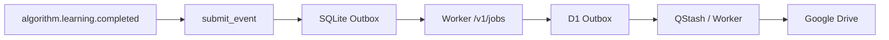

# Algorithm Learning

面向 LeetCode、Hot 100 和同类算法题的中文学习 Skill。它优先理解并保留用户自己的思路，在此基础上做代码诊断、渐进提示、完整题解、复杂度分析和个性化复习。

## 什么时候使用

- 代码出现编译错误、越界、死循环、答案错误或超时。
- 只想获得提示，不希望立即看到完整答案。
- 需要完整题解、可提交代码和复杂度分析。
- 想专项学习动态规划、回溯、树、图、滑动窗口、二分或剪枝。
- 想记录完成情况，生成后续每日练习。

## 工作方式

用户提供代码时，Skill 会沿用原编程语言，并按以下顺序处理：

```text
理解现有思路
  ↓
判断核心路线
  ↓
定位编译 / 运行时 / 逻辑 / 边界 / 性能问题
  ↓
给出小反例与最小修改
  ↓
必要时补充推荐实现与复习点
```

用户只要提示时，答案会按“题型方向 → 核心观察 → 状态或数据结构 → 伪代码 → 局部代码 → 完整实现”逐层揭示。

## 长期算法画像

每次学习完成后，Skill 只根据明确证据记录一条追加式事件。明确完成、错误、未掌握或主动打卡会进入事件；证据不足时只记录中性的 `consulted`，不会臆测弱点。

写入链路为：



规范目录：

```text
users/<userId>/algorithm/
├── events/
├── profile/snapshots/
└── plans/daily/
```

`cloud_accepted` 只表示本地 SQLite 已落盘且 D1 已接收任务；`pending` 表示事件仍安全保存在本机等待重试。两种状态都不等于 Drive 已完成。

## 身份与边界

新对话先按姓名通过 `submit_event` 解析或注册全局用户，业务 Skill 不自行创建 `userId`。本 Skill 负责算法学习，不承担 Java 八股、正式模拟面试或面试复盘。

## 开发者入口

- Agent 行为规范：[SKILL.md](./SKILL.md)
- 画像与事件契约：[references/algorithm-profile-contract.md](./references/algorithm-profile-contract.md)
- 每日练习协议：[references/algorithm-daily-protocol.md](./references/algorithm-daily-protocol.md)
- 专项检查表：[references/special-topic-checklists.md](./references/special-topic-checklists.md)

从仓库根目录运行契约测试：

```bash
python -m unittest discover -s algorithm-learning/tests -p "test_*.py"
```

真正决定 Agent 行为、事件字段和保存语义的是 `SKILL.md` 与对应 contract；本 README 仅提供面向人的入口。
