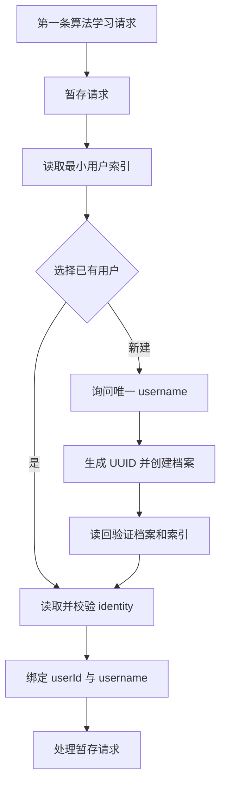
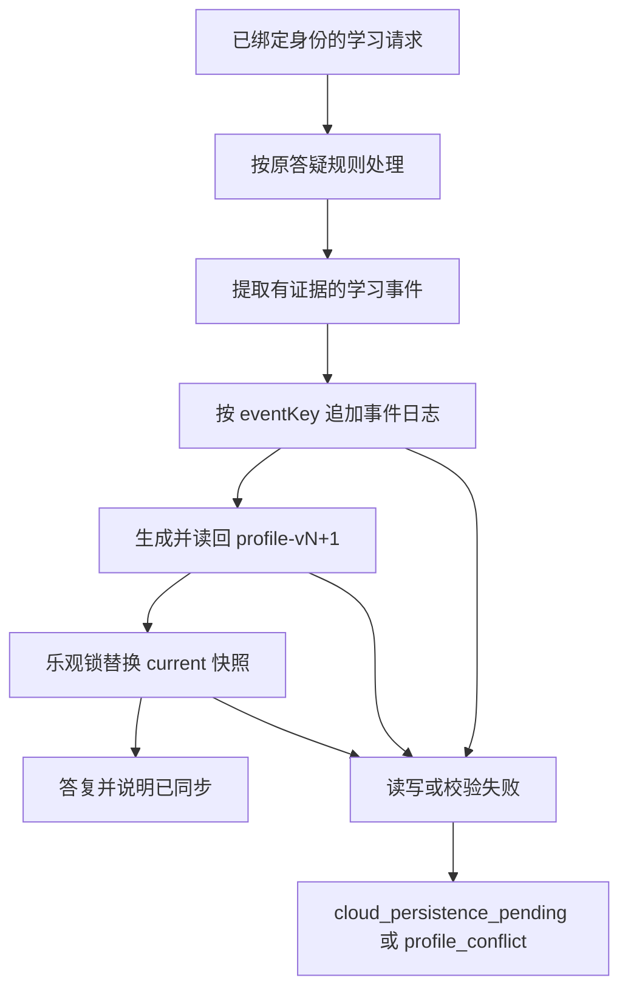

# 对话级身份门禁与即时画像更新计划书

## 目标

保留原有的中文算法讲解、渐进提示、最小修改、复杂度分析和专项检查；新增强制的对话级身份绑定与每次学习后的即时画像更新。所有学习数据存放在 Google Drive 的 `algorithm/` 下，用户数据以 UUID `userId` 隔离，`username` 仅用于用户选择和二次校验。

## 已确认规则

| 主题 | 规则 |
| --- | --- |
| 新对话 | 第一条算法学习请求必须先完成身份选择，不讲题。 |
| 用户选择 | 只读取最小索引并展示 `A. 张三 / B. 李四 / 新建档案`；不展示任何画像详情。 |
| 新用户 | 询问唯一 username，生成 UUID，创建并读回档案后才绑定。 |
| 同一对话 | 身份绑定只校验一次；除非用户说“切换用户”“重新验证身份”或“我不是刚才那个人”。 |
| 每次算法学习请求 | 讲题、改代码、提示、完整解法或打卡结束前都必须写学习事件并立即更新快照。 |
| 无证据咨询 | 写 `consulted`，记录主题但不新增弱点。 |
| 失败 | 任一必要的 Drive 校验或写入失败时返回 `cloud_persistence_pending`，不宣称同步成功。 |
| 每日任务 | 每天 09:00（Asia/Shanghai）为固定用户生成 3～5 题；不得读取用户索引或其他用户目录。 |

## Drive 目录和隔离

```text
algorithm/
  user-index.json
  users/<userId>/
    identity.json
    events/event-log.jsonl
    profile/current/profile-snapshot.json
    profile/history/profile-v<N>.json
    practice/daily-plan-YYYY-MM-DD.json
```

`user-index.json` 只允许包含 `userId`、`username`、`status`、`createdAt`，只在新对话用于枚举用户。选择用户后仍必须读取并验证对应 `identity.json`。除这一个最小索引外，任何流程不得跨用户读取。

## 新对话流程



索引或身份不一致、用户选择不存在、username 重名、建档读回失败，均不绑定身份、不讲题、不读写画像，并要求用户重新选择或稍后重试。

## 单次答疑闭环



事件仅基于事实：代码明确错误为 `incorrect`，明确卡住为 `stuck`，思路未完成为 `partial`，可验证正确或打卡为 `correct` / `completed`，其余为 `consulted`。每个事件都带 `eventKey` 幂等去重；版本冲突不覆盖更晚快照。

## 每日练习

每日任务固定 `userId + username`，先验证该用户 identity 和 current 快照，再优先续做未完成题。总量为 3～5 题；完整包是 1 道薄弱复习、2 道当前专题、2 道综合/变式。若有积压或前日完成不足，压缩新题但不超过 5 道。任何必要 Drive 操作失败时整体中止，不生成题单。

## 验收标准

1. 新对话不会直接讲题，而是展示用户选择。
2. 选中用户后自动处理已暂存的问题，不要求重复提问。
3. 同一对话第二题不重复询问身份。
4. 每次算法学习请求都生成基于证据的事件并将画像版本加一。
5. 身份不一致、事件写入失败或版本冲突不会改变 current 快照。
6. 每日任务从不读取 `user-index.json`，且题单总数为 3～5。
