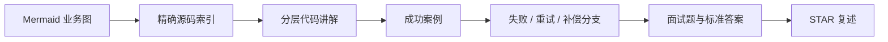

# Backend Project Learning

一个以真实源码为依据的后端项目学习教练。它把陌生代码库整理成可理解、可验证、可面试表达的业务闭环，而不是只逐行翻译代码。

## 适用场景

- 快速认识陌生后端仓库的模块、启动入口和业务边界。
- 追踪一个请求从 Controller 到 Service、缓存、数据库或消息系统的完整链路。
- 理解事务、锁、幂等、缓存一致性、Outbox、MQ 或性能问题在项目中的真实用法。
- 为项目面试准备源码题、设计题和 STAR 口述。
- 在用户明确允许后，为源码添加少量中文学习注释。

## 固定学习闭环



每个模块会先给一张小而闭合的流程图，再给可点击的绝对路径与准确起始行号。讲解聚焦方法职责、复杂代码块的业务意图、关键数据和边界条件，不把 Java 语法逐行翻译一遍。

## 事实边界

所有结论必须明确属于以下一种：

- **源码事实**：能由具体文件和行号验证。
- **教学假设**：只用于帮助理解，不能冒充项目真实数据。
- **优化建议**：当前代码未必已经实现，需要说明依据与取舍。

不会虚构 QPS、用户量、延迟收益、线上事故或简历成果。只有源码实际涉及某种机制时，才会深挖高并发、一致性、异步或性能问题。

## 是否修改源码

默认只读。只有用户明确要求修改时，才会先给证据、影响范围和验证方案，再做最小改动。不会顺手格式化或覆盖用户已有修改。

## 与其他 Skill 的关系

```text
Backend Project Learning
        ↓ 吃透真实项目
Mock Interview
        ↓ 生成不可变会话证据
Interview Review
        ↓ 复盘与画像更新
```

本 Skill 本身不使用 Reliable Drive Sync，也不维护跨会话用户画像。

## 开发者入口

- Agent 行为规范：[SKILL.md](./SKILL.md)
- 可复制学习提示：[references/copy-paste-prompt.md](./references/copy-paste-prompt.md)

真正决定 Agent 的源码核对、交互节奏、注释边界和面试训练方式的是 `SKILL.md`。
