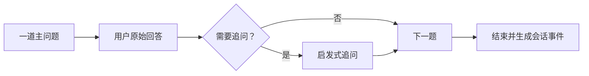

# Java Backend Mock Interview

面向 Java 后端求职准备的模拟面试 Skill。它的重点不是在面试过程中教学，而是保持真实节奏并完整保留原始问答证据，供后续复盘使用。

## 负责什么

- 按姓名解析当前用户。
- 根据简历、项目、历史弱点、领域知识、算法和业务场景组织题目。
- 一次只问一道主问题，并根据回答继续追问。
- 保存原问题、原回答、追问关系和时间线。
- 生成不可变的 `interview.session.completed` 会话事件。
- 把 `sessionId` 和 `review_pending` 状态交给复盘 Skill。

它不负责最终评分、整场复盘或面试画像更新。

## 面试节奏



面试中不会直接提供完整标准答案。用户回答“不知道”时，原回答仍会被保留，最多提供一次启发式追问后继续。

## 不可变会话证据

每题会保留：

```text
questionId
domain
sourceTags / topicTags
originalQuestion
originalAnswer
followUps
timeline
```

原始回答不会在复盘阶段被改写成更好的答案。结束时生成 `MOCK-<UTC>-<uuid>` 格式的 `sessionId`，会话状态为 `review_pending`。

## 持久化与本地副本

会话只调用一次 `submit_event(interview.session.completed)`。事件先进入本地 SQLite Outbox，再由 Worker、D1 Outbox 和 QStash 异步写入：

```text
users/<userId>/interview/events/
```

本地可移植副本保存为：

```text
outputs/interview/<userId>/interview-<sessionId>-session.json
```

本地 JSON 不上传，也不是画像快照来源。`cloud_accepted` 只表示 D1 已接收；`pending` 表示仍在本机排队。二者都不能描述为 Drive 已完成。

## 与 Interview Review 的关系

```text
Mock Interview
  └─ 原始会话证据 + review_pending
          ↓
Interview Review
  └─ 逐题分析 + 更好回答 + 画像变化 + 本地报告
```

## 开发者入口

- Agent 行为规范：[SKILL.md](./SKILL.md)
- 面试协议：[references/interview-protocol.md](./references/interview-protocol.md)
- 候选人画像集成：[references/candidate-profile-integration.md](./references/candidate-profile-integration.md)
- 报告评分规范：[references/report-rubric.md](./references/report-rubric.md)
- Schema 说明：[schemas/README.md](./schemas/README.md)

从仓库根目录运行：

```bash
python -m unittest discover -s conducting-java-backend-mock-interviews/tests -p "test_*.py"
```
