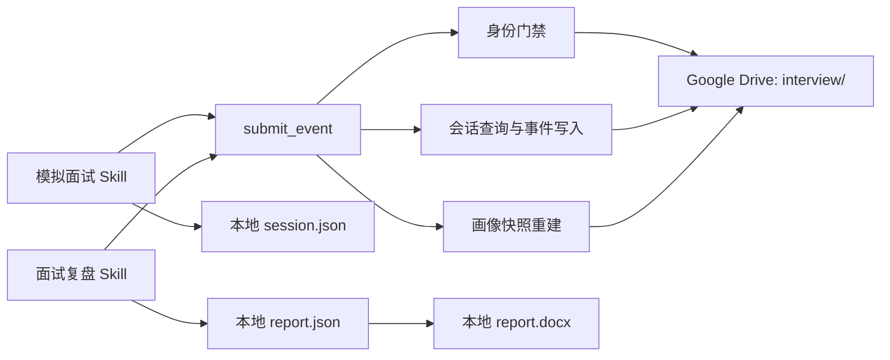

# 面试系统单一 `submit_event` 重构设计

## 目标

以 `algorithm-learning` 的身份门禁和追加式事件模型为基准，重构以下两个 Skill：

- `conducting-java-backend-mock-interviews`
- `reviewing-java-backend-interviews`

重构后，`reliable-drive-sync` MCP 对外只暴露 `submit_event`。模拟面试、跨对话复盘、身份创建、身份验证、历史会话读取和画像重建都通过这一入口完成。Google Drive 只保存不可变 JSON；本地生成会话 JSON、复盘 JSON 和由复盘 JSON 派生的 Word 报告。

## 已确认范围

- 面试使用独立的 `interview/` 身份空间，不与 `algorithm/` 共用注册记录或用户目录。
- 每个新对话都必须重新列出、选择并验证身份；身份绑定只在当前对话有效。
- MCP 对外只保留 `submit_event`，但该工具可依据固定 `eventType` 在内部执行必要的 Drive 查询。
- 为避免移除旧工具后破坏现有算法学习，`algorithm-learning` 的身份与学习事件调用也迁移到同一个 `submit_event`；算法答题行为保持不变。
- 新对话通过同一个工具读取历史会话，支持跨对话复盘。
- 云端会话、复盘、画像和身份数据全部为 JSON。
- 模拟面试结束时在本地生成会话 JSON。
- 面试复盘结束时在本地生成报告 JSON，并从该 JSON 派生 Word 报告。
- 会话 JSON 和复盘 JSON 的完整核心数据也要作为不可变事件提交至 Drive。
- 本地报告不参与画像重建；画像只消费经过验证的云端复盘事件中的结构化画像字段。
- 不迁移、不扫描、不改写现有的旧姓名目录。旧数据原样保留。

## 非目标

- 不提供通用 Drive 文件浏览、任意路径读取或任意文件写入能力。
- 不把 Word、Markdown、Base64 或其他二进制内容保存到 Drive。
- 不在新系统中继续使用候选人姓名作为主键。
- 不自动迁移旧姓名文件夹、旧会话或旧报告。
- 不让会话事实或自然语言报告直接改变画像。

## 总体架构

MCP 的 `tools/list` 只返回：

```text
submit_event
```

下列旧工具不再暴露：

```text
find_or_create_candidate
list_candidates
get_candidate_context
read_artifact
submit_artifact
```

服务端可以保留内部 Drive 辅助函数，但调用方只能提交固定 Schema、固定命名空间和固定事件类型。调用方不能指定 Drive 文件名、文件夹 ID或任意路径。



## Google Drive 数据布局

```text
interview/
  user-registry/
    registration-<userId>.json
  users/
    <userId>/
      identity.json
      events/
        event-<eventId>.json
      profile/
        snapshots/
          snapshot-<observedAt>-<eventId>.json
```

`userId` 是唯一主键。`username` 只用于展示、用户选择和身份二次校验，不能替代主键。所有新文件使用 UTF-8 JSON。

注册记录是新对话唯一允许跨用户读取的数据，只包含：

```json
{
  "schemaVersion": "1.2",
  "userId": "UUID",
  "username": "乔炳源",
  "status": "active",
  "createdAt": "ISO-8601"
}
```

事件是唯一事实来源。画像快照是可丢弃、可重建缓存。所有事件和快照只创建、不覆盖、不移动、不删除。

## `submit_event` 接口

统一请求：

```json
{
  "schemaVersion": "1.2",
  "namespace": "interview",
  "eventType": "identity.list",
  "identity": {
    "userId": "已绑定身份后填写",
    "username": "已绑定身份后填写"
  },
  "payload": {},
  "requestId": "UUID"
}
```

`namespace` 必须来自服务端枚举，只允许 `algorithm` 或 `interview`。面试流程固定为 `interview`，不得包含路径片段。

允许的 `eventType`：

| `eventType` | 行为 |
| --- | --- |
| `identity.list` | 只读取最小注册记录并返回用户选项 |
| `identity.create` | 创建身份目录、身份锁和注册记录 |
| `identity.verify` | 校验用户 ID、姓名、Schema 和父目录 |
| `interview.session.list` | 列出已验证用户的历史会话摘要 |
| `interview.session.load` | 读取指定会话及其有效复盘事件 |
| `interview.session.completed` | 提交完整模拟或真实面试会话事件 |
| `interview.review.completed` | 提交完整复盘事件并尝试重建画像快照 |
| `algorithm.learning.completed` | 为已验证的算法用户追加一个学习事件，不改变算法答题内容 |

统一响应：

```json
{
  "status": "ok",
  "identity": {
    "userId": "UUID",
    "username": "乔炳源"
  },
  "data": {},
  "receipt": {
    "eventId": "UUID",
    "eventKey": "稳定幂等键",
    "fileId": "Drive 返回的真实文件 ID"
  }
}
```

写操作没有返回真实 `fileId` 时，Skill 不得声称云端保存成功。

## 对话级身份门禁

### 新对话选择已有身份

1. 暂存用户的第一条面试或复盘请求，不开始业务处理。
2. 调用 `submit_event`，使用 `eventType: identity.list`。
3. 展示 `A. 用户名 / B. 用户名 / 新建用户`，不展示画像或会话详情。
4. 用户选择已有身份后，调用 `identity.verify`。
5. MCP 校验 `identity.json` 的 `schemaVersion`、`userId`、`username` 和真实父目录。
6. 验证成功后将身份绑定到当前对话，并自动恢复暂存请求。

同一对话后续请求沿用绑定身份。用户明确要求切换身份时解除绑定并重新执行门禁。切换到新对话时不能复用原绑定，必须重新列出、选择和验证。

### 创建新身份

1. 用户选择“新建用户”后，Skill 询问全局唯一 `username`。
2. MCP 规范化姓名并枚举有效注册记录。
3. 发现同名有效注册时返回 `username_conflict`，不得静默合并。
4. MCP 生成 UUID，创建 `users/<userId>/`、`events/` 和 `profile/snapshots/`。
5. 创建并读回 `identity.json`，校验内容和父目录。
6. 最后创建并读回 `registration-<userId>.json`。
7. 所有步骤成功后才返回已验证身份并允许对话绑定。

注册记录最后创建，避免未完成身份出现在用户列表中。

## 模拟面试 Skill

身份验证成功后，模拟面试继续遵守现有业务规则：一次只问一道主问题；允许连续追问；用户说不会时保留原回答并最多启发一次；面试过程中不提供完整标准答案。

简历仅在当前对话用于出题，不上传原文件。需要保留的简历事实以结构化来源字段写入会话事件，简历声明不能直接成为能力证据。

身份绑定后生成：

```text
sessionId = MOCK-<UTC>-<UUID>
```

面试结束时构造一个完整会话事件：

```json
{
  "schemaVersion": "1.2",
  "eventId": "UUID",
  "eventKey": "<userId>:interview:session:<sessionId>:v1",
  "eventType": "interview.session.completed",
  "userId": "UUID",
  "username": "乔炳源",
  "sessionId": "MOCK-<UTC>-<UUID>",
  "interviewType": "mock",
  "domain": "java-backend",
  "startedAt": "ISO-8601",
  "completedAt": "ISO-8601",
  "status": "review_pending",
  "resumeContext": {
    "used": true,
    "source": "current_conversation",
    "claims": []
  },
  "questions": [
    {
      "questionId": "UUID",
      "question": "问题原文",
      "answer": "用户原始回答",
      "followUps": [],
      "sourceTags": [],
      "topicTags": [],
      "timeline": []
    }
  ]
}
```

提交顺序：构造规范 JSON，调用 `interview.session.completed`，按 `eventKey` 去重，创建并读回事件，返回 Drive 回执，然后生成本地会话 JSON。

## 面试复盘 Skill

新对话复盘时，身份验证完成后调用 `interview.session.list`。该操作只返回会话时间、领域、类型和复盘状态等摘要。用户选定会话后调用 `interview.session.load`，MCP 才返回目标会话和其有效复盘事件。

复盘必须保存原问题、原回答、追问关联、正确性、完整性、错误、遗漏、失分原因、更好的口语回答、参考答案、表达分析和变式复测。

规范复盘事件：

```json
{
  "schemaVersion": "1.2",
  "eventId": "UUID",
  "eventKey": "<userId>:interview:review:<sessionId>:v1",
  "eventType": "interview.review.completed",
  "userId": "UUID",
  "username": "乔炳源",
  "sessionId": "MOCK-<UTC>-<UUID>",
  "reviewVersion": 1,
  "sourceSessionEventId": "UUID",
  "sourceType": "mock",
  "evidenceType": "full_transcript",
  "evidenceConfidence": "high",
  "questionReviews": [],
  "profileChanges": [],
  "recommendations": [],
  "applyProfileChanges": true,
  "completedAt": "ISO-8601"
}
```

模拟面试的已验证复盘默认允许应用结构化画像变化。真实面试若只有用户回忆，必须降低证据等级；画像变化必须经过用户明确确认。未确认的真实复盘可以保存，但必须使用 `applyProfileChanges: false`，不得进入画像快照。

修正旧复盘时创建 `v2` 或更高版本事件，不覆盖旧事件。同一弱点只有在两个不同会话、不同问法的正确证据后才允许关闭。

## 云端事件、本地文件与画像的边界

本地目录：

```text
outputs/
  interview/
    <userId>/
      interview-<sessionId>-session.json
      interview-<sessionId>-report.json
      interview-<sessionId>-report.docx
```

模拟面试结束时生成会话 JSON。复盘完成时生成报告 JSON，再以报告 JSON 为唯一输入生成 Word，并执行渲染检查。

本地 JSON 与云端事件共享同一份核心数据。本地文件可以增加 `persistenceStatus` 和 Drive 回执，但不得改变面试事实。Word 是阅读、打印和分享用的派生文件，不上传 Drive。

画像快照只消费有效复盘事件中的以下结构化字段：

```text
profileChanges
evidenceRefs
evidenceConfidence
applyProfileChanges
```

本地会话 JSON、本地报告 JSON、Word、参考答案正文和其他自然语言报告内容均不是快照输入。未复盘的会话事件只提供原始证据，不能直接改变画像。

## 追加写入、幂等与恢复

每次调用在 MCP 内部重新验证身份。读取的每条注册、身份、事件和快照都必须校验 Schema、身份字段和真实父目录。

事件写入规则：

1. 列出目标用户的有效事件并按 `eventKey` 查重。
2. 相同事件键且规范化 JSON 内容一致时，返回最早有效事件的回执，不创建新文件。
3. 相同事件键但内容不同时返回 `event_key_conflict`。
4. 新事件创建为唯一的 `event-<eventId>.json`。
5. 使用 Drive 返回的 `fileId` 读回，校验事件键、身份、会话和父目录。
6. 读回成功后才能报告事件已保存。

复盘事件读回后，MCP 从全部有效、去重且允许应用的复盘事件重建画像，并创建新的不可变快照。快照不是事实来源；缓存失败时，下次读取从事件重新生成。

## 错误状态

| 状态 | 含义与 Skill 行为 |
| --- | --- |
| `ok` | 查询、验证或写入成功 |
| `identity_required` | 尚未完成身份选择，暂停业务处理 |
| `identity_mismatch` | 用户 ID、姓名、Schema 或目录不匹配，不绑定身份 |
| `username_conflict` | 存在重复有效姓名，要求重新选择或改名 |
| `event_key_conflict` | 同一事件键对应不同内容，停止提交并调查 |
| `not_found` | 身份或会话不存在，不进行后续读取或写入 |
| `cloud_persistence_pending` | 事件未可靠写入并读回，不宣称云端成功 |
| `profile_cache_pending` | 事件已保存，但画像快照失败；下次从事件重建 |

云端写入失败时，仍生成本地 JSON，并把 `persistenceStatus` 标记为 `cloud_persistence_pending`。不得调用旧 MCP 工具或直连 Drive 兜底。

复盘事件已保存但快照失败时，本地报告正常生成，并明确事件已保存、画像缓存待重建。

Word 生成或渲染失败不回滚云端事件或本地报告 JSON。Skill 必须保留 JSON 并明确说明 Word 未生成。

## 测试设计

### MCP 接口测试

- `tools/list` 只包含 `submit_event`。
- 调用旧工具返回工具不存在。
- 每种 `eventType` 都有严格输入校验。
- 拒绝任意 namespace、路径片段和调用方文件名。

### 身份门禁测试

- 新对话先暂存请求并显示 `A. 用户 / B. 用户 / 新建用户`。
- 新身份必须完成目录、身份锁和注册记录读回才能绑定。
- 同名有效注册返回 `username_conflict`。
- 身份字段、Schema 或父目录不匹配时不得绑定。
- 新对话不能复用旧对话身份。
- 未验证身份时不能列出或读取会话。

### 事件与画像测试

- 相同事件安全重试，不创建重复文件。
- 同键不同内容返回 `event_key_conflict`。
- 不同用户无法读取彼此会话。
- 会话事件不会直接改变画像。
- 只有 `applyProfileChanges: true` 的有效复盘事件进入画像。
- 快照不读取本地文件、Word 或报告自然语言。
- 快照失败后能够从完整复盘事件集合重建。

### Skill 与本地报告测试

- 两个 Skill 只调用 `submit_event`。
- Skill 不包含旧 MCP 工具或 Drive 直连兜底。
- 云端事件只使用 JSON，不出现 Markdown、Base64 或 DOCX 提交。
- 模拟面试结束生成本地会话 JSON。
- 复盘结束生成本地报告 JSON，并由它生成 Word。
- Word 渲染失败不影响本地 JSON 和云端事件。

### 端到端验收

覆盖完整路径：新建用户，模拟面试，提交并读回会话事件；在新对话重新选择并验证身份；列出并加载历史会话；完成复盘；提交并读回复盘事件；重建画像快照；生成本地报告 JSON 和经过渲染检查的 Word。

同时覆盖云端事件失败、画像缓存失败、Word 生成失败、真实面试画像变化未确认和跨用户读取被拒绝等恢复路径。

## 实施边界

本次实施修改 MCP、两个面试 Skill、与其直接相关的协议/Schema/报告脚本和测试，并把 `algorithm-learning` 的身份与事件调用迁移到唯一的 `submit_event`。算法答疑内容与后端项目学习行为不变。旧姓名目录和旧云端数据不迁移。
