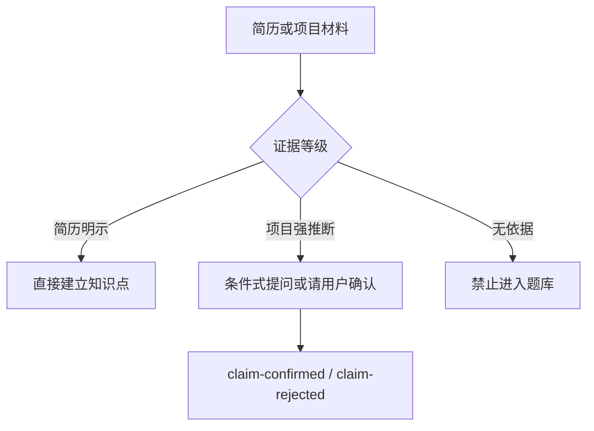

# Resume-Based Java Knowledge Learning

一个严格依据用户真实简历进行 Java 后端知识学习的个性化 Skill。它不随机抽取“高频八股”，而是让每道题都能追溯到简历明示内容或可核实的项目强推断。

## 支持领域

- Java 与 JVM
- MySQL、Redis、MQ
- Spring、Spring Boot、微服务
- 简历中实际出现的中间件
- 与真实项目声明相关的场景追问

没有简历时会停止出题并请用户先提供简历，不会退化为通用题库。

## 四种模式

| 模式 | 用途 |
| --- | --- |
| 简历初始化或更新 | 提取简历声明、建立知识地图并生成版本化题库 |
| 逐题学习 | 回答一道题后评分、反馈并更新掌握度 |
| 每日练习 | 读取或生成当天固定题单，只先展示题面 |
| 掌握度查看 | 查看覆盖率、低分项、近期问题和下一轮重点 |

## 简历证据规则



证据不足时宁可少出题，也不会用无依据内容补齐数量。

## 单题反馈与掌握度

用户回答后会返回总分与四维分数、已答对内容、错误和遗漏、推荐回答链、可直接使用的参考回答，以及掌握度变化和保存状态。回答前不会泄露评分点或完整参考答案。

题目掌握度采用：

```text
首次作答：mastery = 当前得分
后续作答：newMastery = 0.6 × 当前得分 + 0.4 × 原掌握度
```

同一用户、同一自然日、同一 `questionKey` 只接受第一次回答更新画像；当天再次回答仍给反馈，但不重复计分或提交画像事件。

## 每日练习

默认题单由以下结构组成：

```text
2 × 最低掌握度
1 × 未考简历明示题
1 × 项目场景追问
1 × 历史低分复测
```

证据不足时可以少于五题。定时任务由用户自行创建，本 Skill 不创建或管理自动化。

## 身份与持久化

Skill 按姓名解析全局 `userId`，所有写入只经过 `submit_event`：

```text
Skill → SQLite Outbox → Worker /v1/jobs → D1 Outbox → QStash / Worker → Google Drive
```

规范目录为：

```text
users/<userId>/resume-knowledge/
├── sources/resume/snapshots/
├── question-bank/snapshots/
├── events/
├── profile/snapshots/
└── plans/daily/
```

`cloud_accepted` 表示 D1 已接收，不代表 Drive 已完成；`pending` 表示 SQLite 已安全排队。

## 与面试 Skill 的边界

- 本 Skill：简历声明、题库、单题学习、评分、掌握度和每日练习。
- Mock Interview：正式面试节奏、连续追问和整场会话。
- Interview Review：整场复盘、结构化画像变化和报告。

## 开发者入口

- Agent 行为规范：[SKILL.md](./SKILL.md)
- 简历证据策略：[references/resume-evidence-policy.md](./references/resume-evidence-policy.md)
- 题库契约：[references/question-bank-contract.md](./references/question-bank-contract.md)
- 评分契约：[references/feedback-scoring-contract.md](./references/feedback-scoring-contract.md)
- 画像与每日计分：[references/profile-storage-contract.md](./references/profile-storage-contract.md)
- 每日任务模板：[references/daily-task-prompt-template.md](./references/daily-task-prompt-template.md)

从仓库根目录运行：

```bash
python -m unittest discover -s java-knowledge-based-on-resume-learn-skill/tests -p "test_*.py"
```
