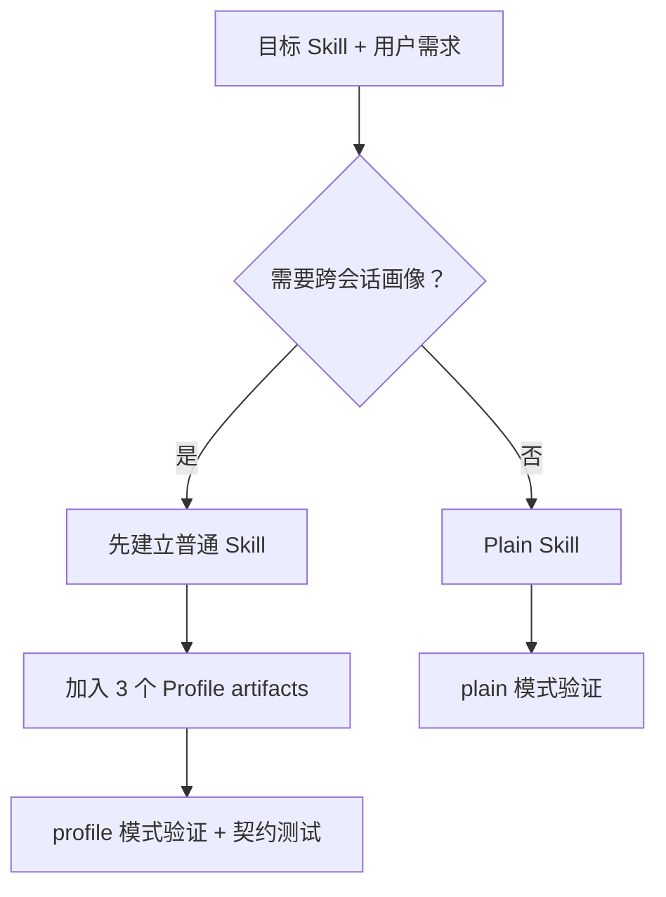

# Profile-Aware Skill Creator

用于创建或更新可复用 Skill 的元 Skill。它先判断目标是否需要跨会话保存并读取个人画像，再在“普通 Skill”和“Profile-aware Skill”两条互斥路径中选择一条。

## 唯一路由问题

> 这个 Skill 是否需要保存并读取跨会话个人画像？

如果用户已经给出答案，就直接遵循，不重复询问。目标目录由用户指定；该目录就是 Skill 根目录，不会再创建同名嵌套目录。



## Plain Skill

普通 Skill 适合一次性处理、代码学习、图像工作流等不需要长期个人状态的任务。

它不会包含以下 Profile 专用文件：

```text
references/profile-contract.md
schemas/profile-capability.json
tests/test_profile_contract.py
```

`SKILL.md` frontmatter 只允许项目契约支持的字段；`name` 必须等于目录名，`description` 必须以 `Use when` 开头。界面显示名如有需要，应放在 `agents/openai.yaml`，而不是 `SKILL.md` frontmatter。

## Profile-aware Skill

Profile-aware Skill 会在普通 Skill 基础上增加且只增加三个核心 artifact：

```text
references/profile-contract.md
schemas/profile-capability.json
tests/test_profile_contract.py
```

契约必须定义可观察证据、画像维度、reducer 与 snapshot，不能把模型主观印象直接保存为画像。

运行时使用当前插件绑定的 RDS V2 通用 `profile` 域，遵守 references/rds-v2-runtime.md：

```text
capabilities
        ↓
user.resolve（凭据绑定身份）
        ↓
身份失败时停止画像功能，交管理员配置
        ↓
普通 Skill 不调用注册操作
        ↓
管理员配置后再次 user.resolve 验证
        ↓
projection.read（namespace=profile，projectionName=domain）
        ↓
满足 recordWhen 时至多一次 profile.evidence.recorded
```

所有操作经插件 `submit_event` 入口。原生只读 DTO 使用 storageVersion=2，不进入 Outbox；业务写使用 schemaVersion=1.2 envelope。pending 仅表示本地排队，d1_committed 表示云端账本已接收，投影与归档另查 event.status。身份或能力校验失败时停止画像功能，普通业务继续；不直接写 Drive，也不迁移 V1 数据。

## 验证

在本目录中运行验证器，并把最后一个参数替换为实际目标 Skill 目录：

```bash
python scripts/validate_profile_skill.py --mode plain <resolved-target-skill-dir>
python scripts/validate_profile_skill.py --mode profile <resolved-target-skill-dir>
```

Profile 模式还必须运行生成的 `tests/test_profile_contract.py`，覆盖能力预检、fail-closed、用户同意、不可变证据以及保留既有内容的完整扫描。

## 开发者入口

- Agent 行为规范：[SKILL.md](./SKILL.md)
- 通用 Skill 规范：[references/portable-skill-standard.md](./references/portable-skill-standard.md)
- Profile 设计规范：[references/profile-authoring-standard.md](./references/profile-authoring-standard.md)
- `submit_event` 运行时：[references/submit-event-runtime.md](./references/submit-event-runtime.md)
- 验证器：[scripts/validate_profile_skill.py](./scripts/validate_profile_skill.py)

本 README 解释使用方式；创建行为和精确文件契约以 `SKILL.md` 及 references 为准。
