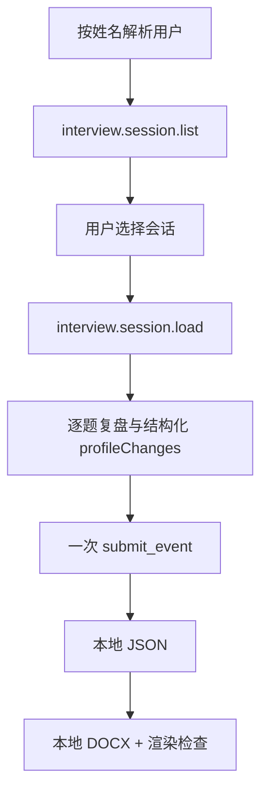

# Java Backend Interview Review

用于复盘模拟面试或真实面试的 Java 后端 Skill。它保留原始会话证据，在此基础上生成逐题分析、改进回答、结构化画像变化和本地报告。

## 能做什么

- 按姓名解析全局用户并选择历史会话。
- 分析正确性、完整性、错误、遗漏和失分原因。
- 给出更自然的口述回答、参考答案和变式复测建议。
- 为模拟面试或经用户确认的真实面试生成画像变化。
- 输出 JSON 与 Word 复盘报告。

## 复盘流程



复盘会引用原问题、原回答和追问，但不会修改这些不可变字段。修订复盘时创建更高的 `reviewVersion`，不覆盖旧事件。

## 模拟面试与真实面试

模拟会话的画像变化默认可以应用。真实面试必须由用户明确确认：未确认时保存 `applyProfileChanges: false`；确认后创建新的不可变版本并设置为 `true`。

只有结构化字段参与画像重建。自然语言报告、Word 文件或本地 JSON 本身不会成为画像输入。

## 唯一提交与保存语义

完整的 `interview.review.completed` 事件只调用一次 `submit_event`，云端写入：

```text
users/<userId>/interview/events/
users/<userId>/interview/profile/snapshots/
```

本地派生输出：

```text
outputs/interview/<userId>/interview-<sessionId>-report.json
outputs/interview/<userId>/interview-<sessionId>-report.docx
```

JSON 先生成，Word 以该 JSON 为唯一输入。Word 生成失败不会回滚已提交事件或删除 JSON。`cloud_accepted` 与 `pending` 都不代表 Drive 已完成。

## 开发者入口

- Agent 行为规范：[SKILL.md](./SKILL.md)
- 复盘协议：[references/review-protocol.md](./references/review-protocol.md)
- 画像契约：[references/profile-contract.md](./references/profile-contract.md)
- 共享面试系统设计：[references/shared-interview-system-design.md](./references/shared-interview-system-design.md)
- Schema 说明：[schemas/README.md](./schemas/README.md)

从仓库根目录运行：

```bash
python -m unittest discover -s reviewing-java-backend-interviews/tests -p "test_*.py"
```
