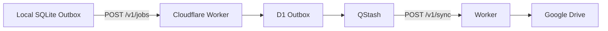

# Services

`services/` 保存仓库的云端运行服务。当前唯一服务是 [Reliable Drive Sync Worker](./reliable-drive-sync-worker/README.md)。

## Reliable Drive Sync Worker

Cloudflare Worker 负责接收经过验证的 schema-1.2 envelope，把任务持久化到 D1 Outbox，再通过 QStash 异步写入 Google Drive。



## 职责

- 校验 schema-1.2 envelope、namespace、eventType、身份和 payload。
- 通过全局注册表解析稳定 `userId`，拒绝身份冲突。
- 在返回 HTTP 202 前将 Job 写入或幂等命中 D1 Outbox。
- 路由 Skill-owned 事件并物化对应 Snapshot。
- 通过 QStash 调度 `/v1/sync`，处理重试与最终 Drive 写入。
- 维护唯一规范根目录 `DriveRoot/my-chatGPT-skills/`。
- 对旧 namespace 数据执行只读兼容和显式批准的安全迁移。

## 接口边界

| 接口 | 用途 |
| --- | --- |
| `POST /v1/jobs` | 接收需要进入两级 Outbox 的写事件 |
| `/v1/query` | 只读会话查询和 legacy migration dry-run，不进入 Outbox |
| `POST /v1/sync` | 由 QStash 签名调用，执行异步持久化 |

Worker 不暴露远程 MCP endpoint。上层 Skill 只看到本地 MCP 的 `submit_event`，不会直接调用这些 HTTP 接口或 Google Drive。

## 可靠性语义

`/v1/jobs` 返回 HTTP 202 只代表 D1 已持久接收任务，不代表 Drive 已完成。Drive 临时失败由 QStash 和 Worker 重试。幂等、身份、事件键、projection 和 migration 冲突会按明确错误状态停止，而不是静默覆盖数据。

## 继续阅读与测试

- 完整部署、事件类型、错误状态和迁移边界：[reliable-drive-sync-worker/README.md](./reliable-drive-sync-worker/README.md)
- 本地入口：[../tools/reliable-drive-sync-mcp/README.md](../tools/reliable-drive-sync-mcp/README.md)
- 仓库总览：[../README.md](../README.md)

从 Worker 目录运行：

```bash
cd services/reliable-drive-sync-worker
npm test
```

部署密钥、OAuth 配置和 D1 migration 命令以 Worker 自己的 README 为准。
